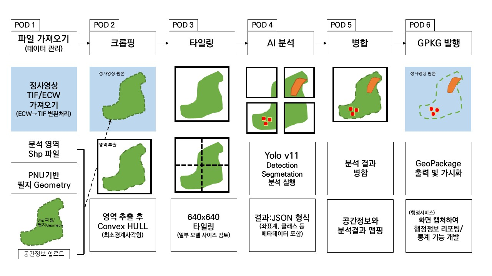
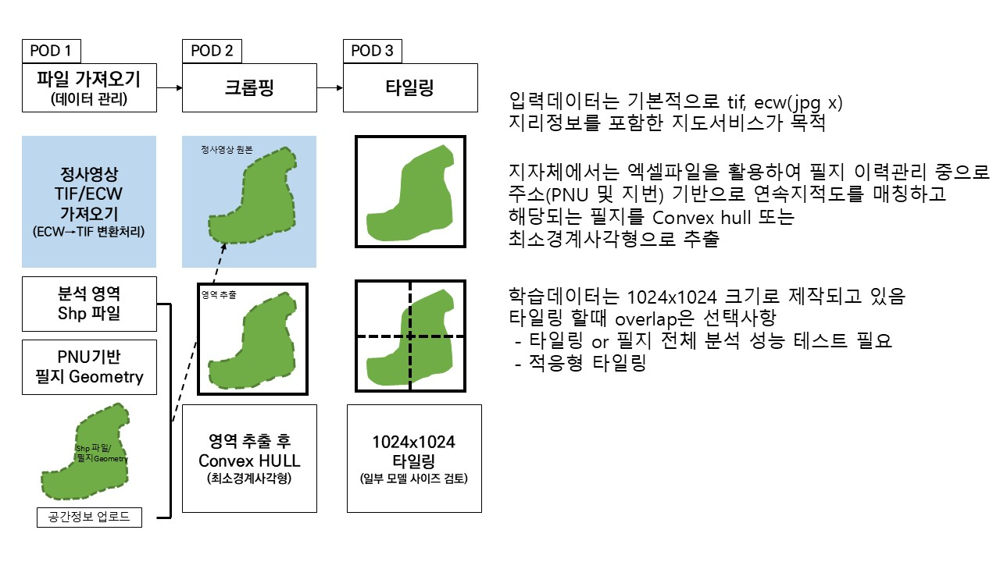
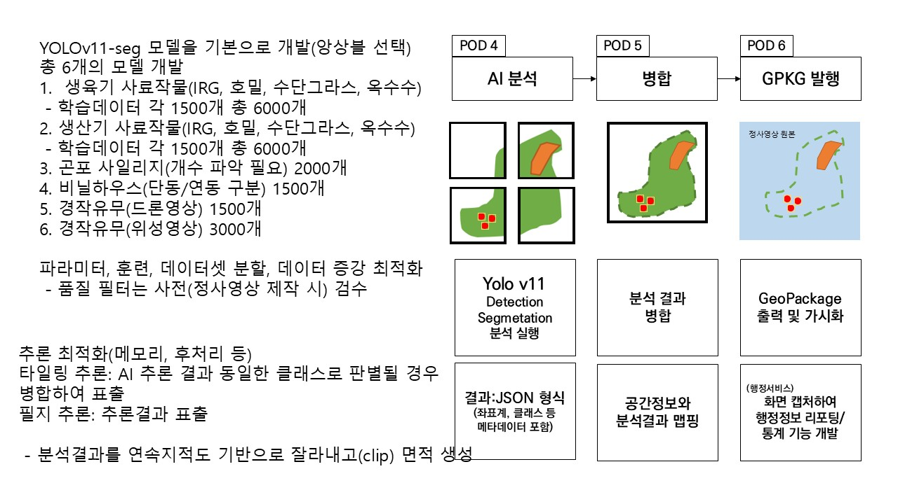

# 📂 데이터 및 리소스

이 폴더는 Nong-View2 프로젝트의 데이터, 이미지, 기타 리소스를 저장하는 공간입니다.

## 📁 저장된 파일 목록

### 🖼️ 이미지 파일
- **`파이프라인 구조.png`** - Nong-View2 6단계 POD 파이프라인 구조도
- **`슬라이드1.JPG`** - 프로젝트 소개 슬라이드
- **`슬라이드2.JPG`** - 시스템 구성 슬라이드
- **`슬라이드3.JPG`** - 기술 아키텍처 슬라이드

### 📄 프로젝트 문서
- **`(사업계획서) 스마트 영농관리 서비스, 농뷰(Nong-View) 구축_0919.pdf`**
  - 스마트 영농관리 서비스 사업계획서
  - Nong-View 시스템 구축 계획
  
- **`'25년 스마트빌리지(남원시청) 중간보고회 발표자료v6.pdf`**
  - 2025년 스마트빌리지 프로젝트 중간보고
  - 남원시청 발표 자료 (버전 6)
  
- **`'25년 스마트빌리지(남원시청) 착수보고회 발표자료v4.pdf`**
  - 2025년 스마트빌리지 프로젝트 착수보고
  - 남원시청 발표 자료 (버전 4)

### 📊 요구사항 문서
- **`요구사항.pptx`** - 프로젝트 요구사항 명세서 (PowerPoint)

## 🖼️ 이미지 사용 방법

### Markdown에서 이미지 참조

```markdown




```

### HTML에서 이미지 참조

```html


```

## 📋 지원 파일 형식

### 이미지
- **PNG**: 다이어그램, 스크린샷
- **JPG/JPEG**: 사진, 정사영상 미리보기
- **SVG**: 벡터 다이어그램, 로고

### 데이터
- **JSON**: API 응답, 설정 파일
- **CSV**: 테이블 데이터
- **XLSX**: Excel 데이터

### 지리정보
- **SHP**: Shapefile (필지 경계 등)
- **GPKG**: GeoPackage
- **GeoJSON**: 웹 호환 지리 데이터
- **TIF/TIFF**: GeoTIFF 래스터 데이터

### 문서
- **PDF**: 기술 문서, 보고서
- **MD**: Markdown 문서

## 📝 파일 추가 가이드라인

1. **파일명**: 소문자와 하이픈 사용 (`sample-data.json`)
2. **크기 제한**: 대용량 파일(>10MB)은 Git LFS 사용 권장
3. **설명 추가**: 파일 추가 시 이 README에 설명 업데이트

## 🔍 빠른 참조

| 파일명 | 유형 | 설명 |
|--------|------|------|
| `파이프라인 구조.png` | 이미지 | 6단계 POD 파이프라인 구조도 |
| `슬라이드1-3.JPG` | 이미지 | 프로젝트 발표 슬라이드 |
| `요구사항.pptx` | 문서 | 프로젝트 요구사항 명세 |
| `(사업계획서)*.pdf` | 문서 | 스마트 영농관리 사업계획서 |
| `*착수보고회*.pdf` | 문서 | 프로젝트 착수 보고 자료 |
| `*중간보고회*.pdf` | 문서 | 프로젝트 중간 보고 자료 |

---

최종 업데이트: 2025-11-06